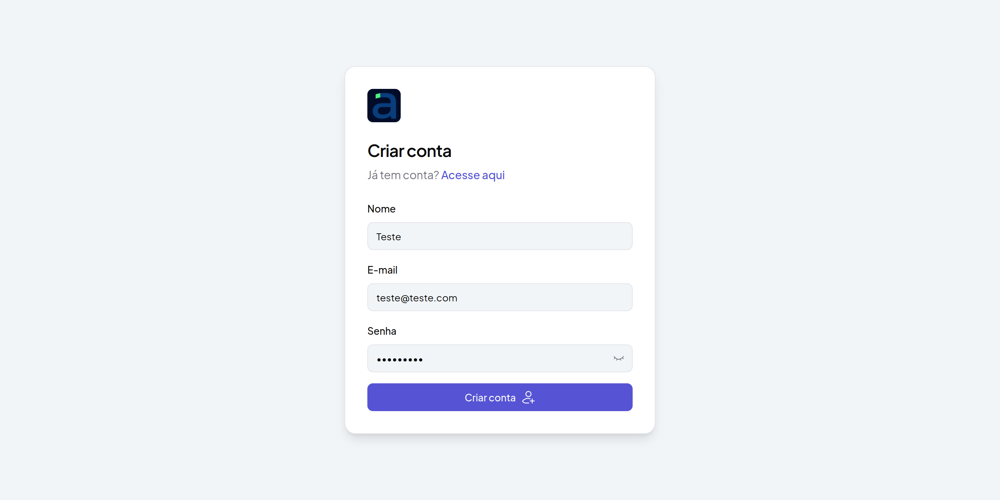
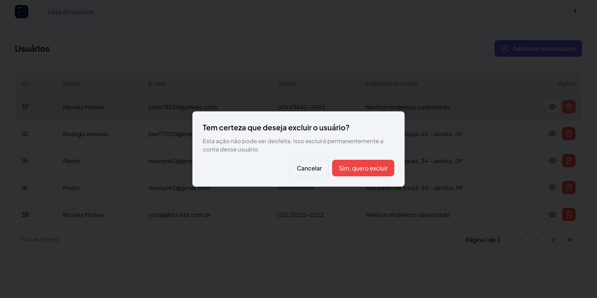
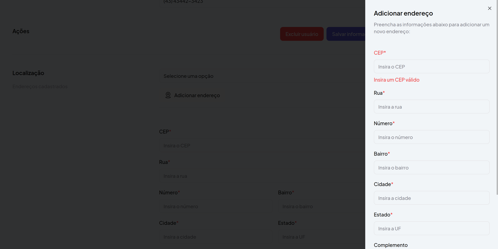
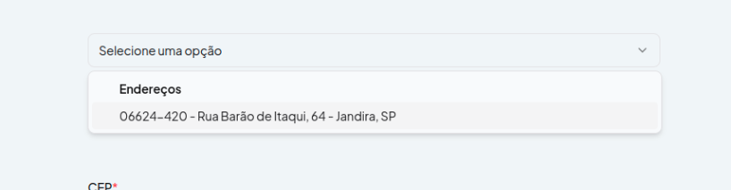

# 📋 Descrição do Projeto

Este projeto foi criado como parte de um desafio técnico para a vaga de desenvolvedor FullStack na empresa Acaruiy. 
O objetivo é implementar uma tela de dados pessoais de usuários que simula o acesso a uma plataforma, exibindo informações de perfil de maneira simples e eficaz. O acesso a esta tela é permitido somente após a autenticação do usuário, garantindo uma navegação segura e controlada.

## 🎯 Objetivo do Projeto

O projeto tem como objetivo:

1. Implementar autenticação de rotas para proteger o acesso às telas de dados dos usuários.
2. Criar uma tela de perfil de usuário que exibe dados pessoais e informações de contato.
3. Permitir o cadastro, edição e exclusão de usuários.
4. Adicionar a funcionalidade de upload de foto de perfil.
5. Listar e gerenciar endereços vinculados aos usuários, incluindo a seleção de um endereço principal.


## Clonar o Repositório

```bash
git clone https://github.com/seu-usuario/acaruiy-teste.git
```

## Configuração do Backend

### 🛠️ Tecnologias Utilizadas

- **Laravel**
- **Docker**

## Pré requisitos

- **Docker**

## Instalar dependencies

Ao acessar
```bash
  cd backend
```

Utilizar o comando a seguir para instalar todas as dependências do projeto via composer

```bash
  docker run --rm \
    -u "$(id -u):$(id -g)" \
    -v "$(pwd):/var/www/html" \
    -w /var/www/html \
    laravelsail/php83-composer:latest \
    composer install --ignore-platform-reqs
```

Recomendo utilizar esse comando pois a versão do composer desse container já está compatível com o projeto

### Configuração do Ambiente

Crie um arquivo .env na raiz do projeto e copie o conteúdo que esté em .env.example

### Comandos para gerenciar o projeto

Para montar os containers e iniciar o servidor:
```bash
  ./vendor/bin/sail up -d
```

Após os testes, para desligar o servidor, utilize o comando abaixo:
```bash
./vendor/bin/sail stop
```

Para realizar as migrations, utilize:
```bash
./vendor/bin/sail artisan migrate
```

Para rodar a seeder de usuários, utilize o comando: 

```bash
./vendor/bin/sail artisan db:seed
```

Após esse fluxo, o servidor estará inicializado e apontado para o http://localhost

Caso seja necessário verificar as rotas existentes, utilize o comando abaixo: 

```bash
./vendor/bin/sail artisan route:list
```

## Configuração do Frontend

### 🛠️ Tecnologias Utilizadas

- **React**
- **Yarn**
- **Axios**: Requisições HTTP.
- **React Router**: Rotas.
- **React Hook Form**: Formulários.
- **Zod**: Validação.
- **TanStack Query (React Query)**: Gerenciamento de estado e cache das requisições.
- **Tailwind CSS**

### 🖥️ Interface

A interface foi desenvolvida com foco na simplicidade e eficiência, proporcionando uma experiência de usuário fluida e intuitiva. 
O layout foi inspirado no exemplo encaminhado. Todos os componentes são responsivos e a navegação é protegida por autenticação de rota.

### 🚀 Como Rodar o Projeto

Siga as instruções abaixo para configurar e executar o projeto em sua máquina local:

### 1. Pré-requisitos

Certifique-se de ter as seguintes ferramentas instaladas:

- **Node.js>18**: [Node.js Download](https://nodejs.org/)
- **Yarn**: [Yarn Download](https://yarnpkg.com/)

### 2. Acessar

```bash
cd acaruiy-teste/web
```

### 3. Instalar Dependências

Execute o comando abaixo para instalar as dependências do projeto:

```bash
yarn install
```

### 4. Configuração do Ambiente

Crie um arquivo .env.local na raiz do projeto com o conteúdo abaixo:

```bash
VITE_API_URL=http://localhost/api
```

### 5. Executar o Projeto

Após instalar as dependências e configurar o ambiente, execute o projeto com a API rodando:

```bash
yarn dev
```

A aplicação estará disponível em http://localhost:3000.

### 6. Testar o app

1. **Acesse** http://localhost:3000
2. **Cadastra-se** clicando em criar conta e preenchendo nome, e-mail e senha. O login será automático após a criação do usuário.
3. **Explore as funcionalidades** de gerenciamento de usuários e endereços.

### 7. Exemplos










## 📋 Funcionalidades

### Autenticação
- ✅ Registro de usuário
- ✅ Login com httpCookie

### Usuários
- ✅ Tela home com listagem dos usuários cadastrados
- ✅ Paginação (5 itens por página)
- ✅ Cadastro de usuário
- ✅ Tela com detalhes dos usuários
- ✅ Edição de dados dos usuários
- ✅ Exclusão de usuários
- ✅ Upload de imagem
- ✅ Criação de endereços vinculados aos usuários
- ✅ Atribuição do endereço principal


### Obrigado pela oportunidade! Abraços 