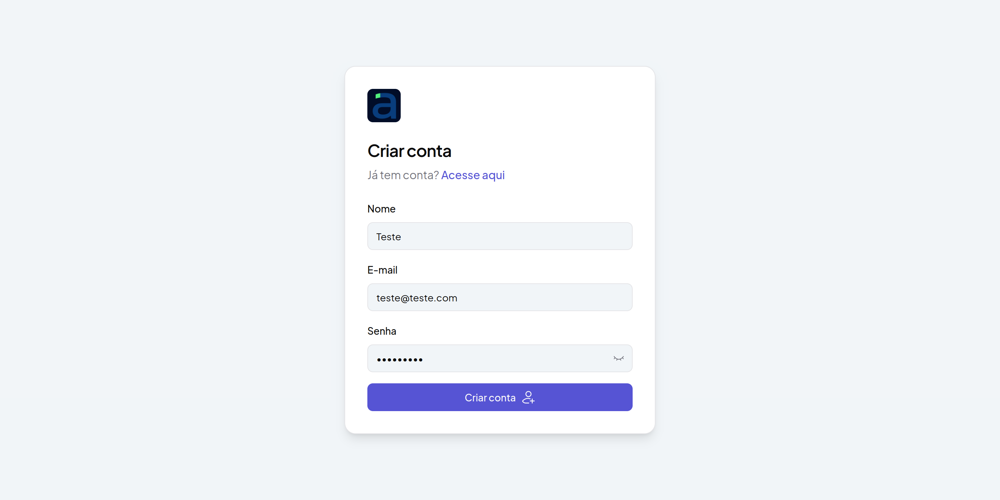
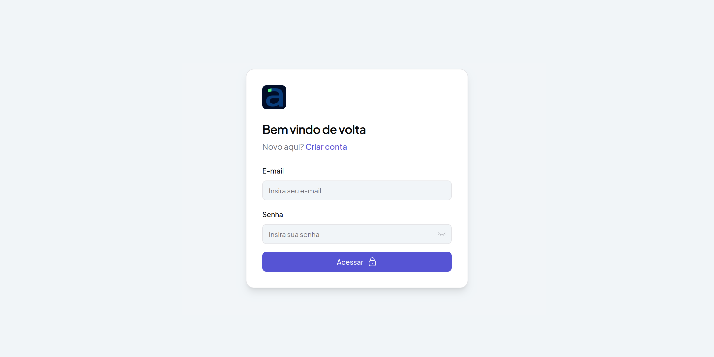
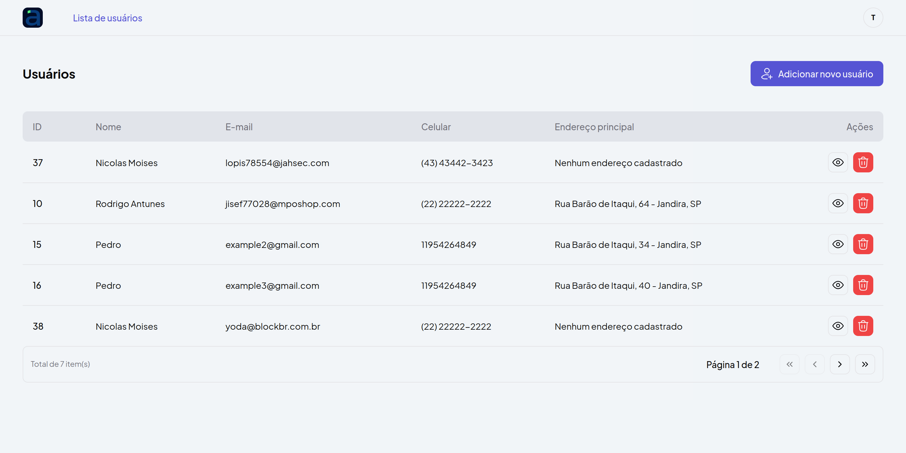
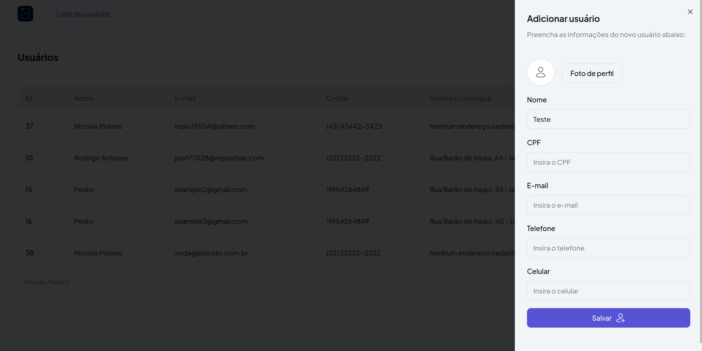
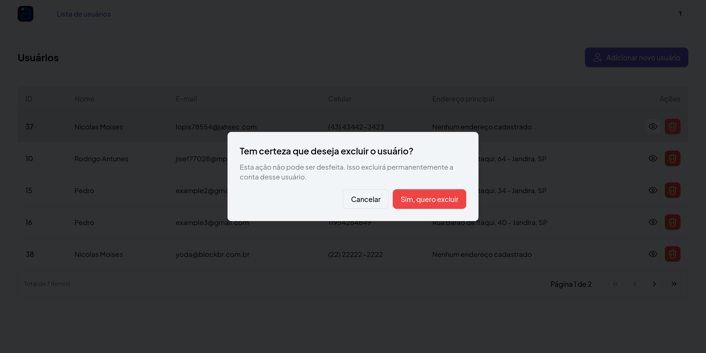
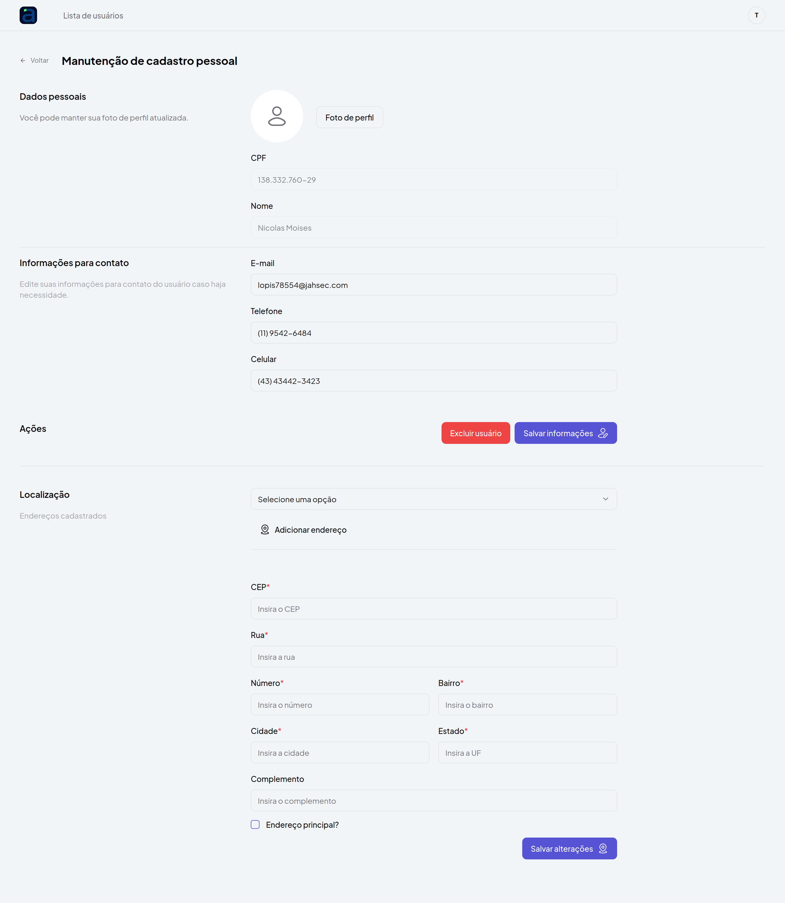
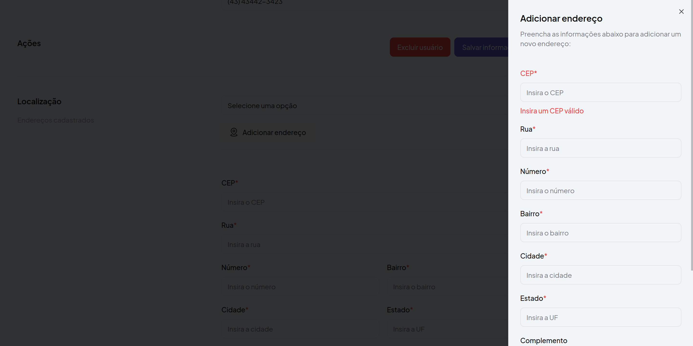
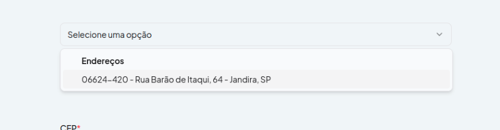

# 📋 Descrição do Projeto

Este projeto foi criado como parte de um desafio técnico para a vaga de desenvolvedor FullStack na empresa Acaruiy. 
O objetivo é implementar uma tela de dados pessoais de usuários que simula o acesso a uma plataforma, exibindo informações de perfil de maneira simples e eficaz. O acesso a esta tela é permitido somente após a autenticação do usuário, garantindo uma navegação segura e controlada.

## 🛠️ Tecnologias Utilizadas

- **React**
- **Yarn**
- **Axios**: Requisições HTTP.
- **React Router**: Rotas.
- **React Hook Form**: Formulários.
- **Zod**: Validação.
- **TanStack Query (React Query)**: Gerenciamento de estado e cache das requisições.
- **Tailwind CSS**

## 🎯 Objetivo do Projeto

O projeto tem como objetivo:

1. Implementar autenticação de rotas para proteger o acesso às telas de dados dos usuários.
2. Criar uma tela de perfil de usuário que exibe dados pessoais e informações de contato.
3. Permitir o cadastro, edição e exclusão de usuários.
4. Adicionar a funcionalidade de upload de foto de perfil.
5. Listar e gerenciar endereços vinculados aos usuários, incluindo a seleção de um endereço principal.

## ⚙️ Funcionalidades

- **Autenticação de Usuário**:
  - [x] Registro de usuário
  - [x] Login utilizando cookies para autenticação
  
- **Gerenciamento de Usuários**:
  - [x] Tela inicial com listagem de usuários cadastrados
  - [x] Paginação na listagem de usuários (5 itens por página)
  - [x] Tela de cadastro de usuário
  - [x] Visualização de detalhes de cada usuário
  - [x] Edição de dados do usuário
  - [x] Exclusão de usuários
  
- **Gerenciamento de Endereços**:
  - [x] Criação e gerenciamento de endereços vinculados aos usuários
  - [x] Atribuição de um endereço como principal
  - [x] Exibição de múltiplos endereços cadastrados

## 🖥️ Interface

A interface foi desenvolvida com foco na simplicidade e eficiência, proporcionando uma experiência de usuário fluida e intuitiva. 
O layout foi inspirado no exemplo encaminhado. Todos os componentes são responsivos e a navegação é protegida por autenticação de rota.

## 🚀 Como Rodar o Projeto

Siga as instruções abaixo para configurar e executar o projeto em sua máquina local:

### 1. Pré-requisitos

Certifique-se de ter as seguintes ferramentas instaladas:

- **Node.js**: [Node.js Download](https://nodejs.org/)
- **Yarn**: [Yarn Download](https://yarnpkg.com/)

### 2. Clonar o Repositório

```bash
git clone https://github.com/seu-usuario/acaruiy-teste.git
cd acaruiy-teste/web
```

### 3. Instalar Dependências

Execute o comando abaixo para instalar as dependências do projeto:

```bash
yarn install
```

### 4. Configuração do Ambiente

Crie um arquivo .env.local na raiz do projeto com o conteúdo abaixo:

```bash
VITE_API_URL=http://localhost/api
```

### 5. Executar o Projeto

Após instalar as dependências e configurar o ambiente, execute o projeto com:

```bash
yarn dev
```

A aplicação estará disponível em http://localhost:3000.

### 6. Testar o app

1. **Acesse** http://localhost:3000
2. **Cadastra-se** clicando em criar conta e preenchendo nome, e-mail e senha. O login será automático após a criação do usuário.
3. **Explore as funcionalidades** de gerenciamento de usuários e endereços.

### 7. Exemplos











## 📋 Checklist de Funcionalidades

### Autenticação
- ✅ Registro de usuário
- ✅ Login com httpCookie

### Usuários
- ✅ Tela home com listagem dos usuários cadastrados
- ✅ Paginação (5 itens por página)
- ✅ Cadastro de usuário
- ✅ Tela com detalhes dos usuários
- ✅ Edição de dados dos usuários
- ✅ Exclusão de usuários
- ✅ Upload de imagem
- ✅ Criação de endereços vinculados aos usuários
- ✅ Atribuição do endereço principal


### Obrigado pela oportunidade! Abraços 